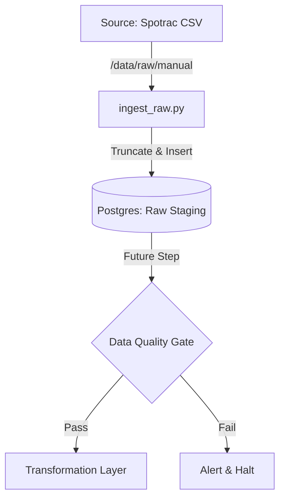

# ⚾ Blue Jays Moneyball: Data Quality–Driven ETL Platform


## 📌 Project Overview

This project is a **Data Quality focused ETL platform** designed to ingest and validate MLB player salary data.

Initially conceived as a complex web scraping pipeline, this project has been **architecturally pivoted** to focus on what matters most in Data Engineering: **Reliability, Reproducibility, and Data Integrity.**

Instead of maintaining brittle scrapers that break with every UI change, this platform establishes a **robust Raw Ingestion Layer** using manual CSV exports as the immutable source of truth. The goal is not just to "get data," but to ensure the data we load is 100% accurate and auditable.

---

## 🔄 The Pivot: Why "Simpler" is Better

### 🚫 The Problem: Over-Engineering
In the early stages (v1), I implemented a complex automated scraper using Playwright and Dockerized browsers. While technically impressive, it introduced:
- **Brittleness:** Frequent failures due to DOM changes and bot detection.
- **Maintenance Debt:** More time spent fixing the scraper than analyzing the data.
- **Silent Failures:** Risk of partial loads or corrupted text.

### ✅ The Solution: Reliable Ingestion (v2)
I refactored the entire pipeline to follow **Senior SDET principles**:
1.  **Manual Source Control:** Spotrac CSV exports are treated as "Golden Data" and versioned.
2.  **Pure Extraction:** A specialized loader (`ingest_raw.py`) loads data *exactly as is* into a `TEXT`-based staging table.
3.  **Fail-Fast Quality Gates:** Validation happens *inside* the warehouse using SQL, ensuring no bad data propagates downstream.

> **"The hardest part of ETL isn't writing code—it's ensuring the pipeline survives in production. I chose stability over complexity."**

---

## 🏗 Architecture & Data Flow



### 🧱 Canonical Data Model (Staging)

* **Table:** `stg_spotrac_bluejays_salary_raw`
* **Strategy:** `TRUNCATE` → `INSERT` (Full Refresh)
* **Schema Design:** All columns are loaded as `TEXT`.
* *Why?* Loading `$10,000` as an Integer causes ingest failures. Loading it as `TEXT` guarantees the data lands in the DB, where we can safely clean and cast it using SQL.


---

## 📂 Project Structure

Refactored to a lean, single-purpose structure:

```text
bluejays-financial-mlops/
├── dags/
│   └── bluejays_simple_dag.py     # The Orchestrator (Airflow)
├── src/
│   ├── db/
│   │   └── models.py              # Pure SQLAlchemy Schema Definitions
│   └── load/
│       └── ingest_raw.py          # The Specialized CSV Loader
├── data/
│   └── raw/manual/                # Immutable Data Landing Zone
├── docker-compose.yaml            # Infrastructure as Code
└── requirements.txt

```

---

## 🛠 Tech Stack

* **Language:** Python 3.12+ (Pandas, SQLAlchemy)
* **Orchestration:** Apache Airflow 2.10+
* **Database:** PostgreSQL
* **Infrastructure:** Docker, Docker Compose
* **Core Competency:** ETL Design Patterns, Data Quality Assurance

---

## ⚙️ How to Run

### 1. Build the Infrastructure

```bash
docker-compose build

```

### 2. Start Services

Launch Airflow (Scheduler, Webserver) and the PostgreSQL database.

```bash
docker-compose up -d

```

* **Airflow UI:** `http://localhost:8080` (User/Pass: `airflow`)

### 3. Trigger the Pipeline

1. Navigate to the Airflow UI.
2. Trigger the **`bluejays_v2_simple_pipeline`** DAG.
3. The pipeline will ingest the raw CSV into the Postgres staging table.

---

## 🗺 Roadmap

| Phase | Focus | Status |
| --- | --- | --- |
| **Phase 1** | **Architecture Simplification & Raw Ingestion** | ✅ **Complete** |
| **Phase 2** | **Fail-Fast DQ Gate** (Schema Validation, Null Checks) | 🚧 In Progress |
| **Phase 3** | **Transformation Layer** (Cleaning, Type Casting) | ⏳ Planned |

---

## 👨‍💻 About the Author

**Chris (Suk Min) Yoon**
*Senior SDET / Data QA Engineer (10+ Years Experience)*

Specializing in **ETL Validation**, **Data Integrity**, and **Automation-First Quality Systems**.

> **Portfolio Note:** This project demonstrates the ability to recognize over-engineering and pivot to a production-grade, maintainable architecture.