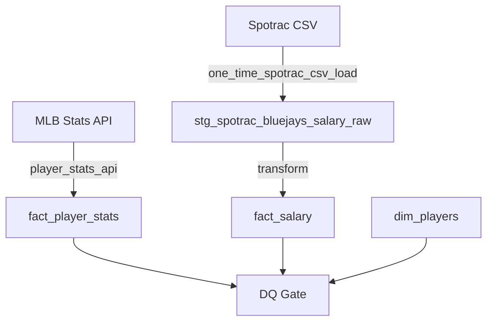

# ⚾ Blue Jays Moneyball: Data Quality–Driven ETL Platform


## 📌 Project Overview

This is a **production-oriented ETL and Data Quality platform** designed to ingest, normalize, and validate MLB player salary and performance data.

While many sports analytics projects focus solely on modeling, **Blue Jays Moneyball** prioritizes the engineering challenges that actually break production systems: **silent join failures, entity resolution issues, and data drift.**

**Core Philosophy:**
> "The hardest problems in analytics aren't the models—they are the pipelines that 'succeed' with corrupted outputs."

This system treats data engineering with **SDET principles**, enforcing strict quality gates to ensure that no data downstream is used for forecasting unless it is proven correct.

## 🔄 Recent Evolution (What Changed)

- Consolidation into a single production-grade baseline DAG using BashOperator.
- CLI-reproducible execution via `PYTHONPATH=/opt/airflow python -m src...`.
- End-to-end DQ Gate now actively blocking bad data (fail-fast).
- Player stats ingestion via MLB Stats API producing snapshot-based facts.
- Introduction of a one-time CSV loader DAG (`one_time_spotrac_csv_load.py`) for manual Spotrac CSV ingestion.
- Removal of legacy salary loaders in favor of the new raw staging approach.

## 🔁 Design Pivot: From Web Scraping to Manual Raw Ingestion

### Why Playwright Scraping Was Abandoned

Initial efforts to scrape Spotrac salary data using Playwright ran into significant roadblocks. Spotrac’s site employs image-like rendering and a heavily obfuscated DOM structure that makes reliable scraping brittle and maintenance-heavy. The scraping approach was costly in engineering time and fragile in production, prone to silent failures that could corrupt downstream data.

After weighing the tradeoffs, we made a conscious decision to **stop scraping Spotrac altogether** and instead rely on **manual CSV exports** as the raw data source.

### New Approach: Manual CSV → Raw → Gold

The new pipeline ingests manually exported CSV files into **raw staging tables** with zero validation or type coercion. This “raw” layer is a simple landing zone that faithfully stores the data exactly as received, preserving all quirks and inconsistencies.

A new one-time Airflow DAG (`one_time_spotrac_csv_load.py`) has been introduced to orchestrate this manual Spotrac CSV ingestion. This DAG loads data into the raw staging table (`stg_spotrac_bluejays_salary_raw`) and triggers subsequent data quality checks.

From there, downstream “gold” tables will be built with rigorous transformations, validations, and entity resolution logic. This separation allows us to isolate messy source data and focus quality efforts where they belong.

The Airflow orchestration is simplified to a one-time DAG using BashOperator that loads raw data and runs the DQ Gate, which now focuses on green-success signals rather than complex scraping workflows.

### Why Raw First (and Not Fact Tables)

Loading raw data directly into fact tables without staging is a recipe for silent data corruption. By landing data raw and untouched, we retain a full audit trail and can apply deterministic transformations later. This approach also makes debugging and reprocessing easier when source data changes or errors are discovered.

### Gold Layer Responsibilities (Planned)

The gold layer will handle critical data quality concerns that cannot be solved upstream:

- Roster changes and player movement over time
- Special characters and inconsistencies in player names
- Full-name normalization and canonicalization
- Entity resolution between Spotrac names and MLBAM player IDs
- Parsing and validating numeric salary values

These tasks require business logic and manual intervention that don’t belong in raw ingestion or automated scraping.

### Philosophy Going Forward

This pivot reflects a pragmatic, engineer-first mindset: **stop chasing brittle automation and focus on reproducible, auditable data ingestion.** We accept manual CSV exports as a necessary evil to guarantee correctness. The pipeline is designed to fail fast on bad data and require explicit quality gates before any analytics or modeling downstream.

---

## 🎯 Key Objectives

1.  **Canonical Entity Resolution:** Deterministically map name-based external data (Spotrac) to canonical MLBAM IDs (`player_id`) using a dedicated bridge table.
2.  **Deterministic Joins:** Ensure 100% reliable joins between disparate salary data and player performance stats.
3.  **Fail-Fast Data Quality:** Detect and block bad data *immediately* via explicit DQ checks in the orchestration layer.
4.  **Automated Infrastructure:** End-to-end execution in **Airflow + Docker + PostgreSQL** without manual intervention.

---

## 🏗 Architecture & Data Flow

This project implements a **Extract → Load → Verify** pattern with a clear raw staging layer to ensure integrity.



### 🧱 Canonical Data Model (Star Schema)

* **`dim_players`**: The source of truth for player identity (Key: `player_id`).
* **`stg_spotrac_bluejays_salary_raw`**: Raw, unvalidated salary data loaded from manual CSV exports.
* **`fact_salary`**: Financial snapshots resolved to the canonical ID after transformation.
* **`fact_player_stats`**: Performance metrics from the MLB API.
* **`bridge_spotrac_player_map`**: A durable mapping table handling name variations (e.g., "Mike Trout" vs "Michael Trout").

---

## 🛡️ Data Quality Gate (Core Feature)

Before any data is promoted to the analytics layer, the **DQ Gate** enforces five strict pillars of integrity. If *any* check fails, the pipeline halts to prevent contamination.

These Data Quality checks are implemented as SQL snapshots executed immediately after data loading completes. Failures in these checks are designed to block all downstream simulation and modeling processes, ensuring that no analytics consume corrupted or incomplete data.

| Check | Description |
| --- | --- |
| **Rowcount Snapshot** | Validates expected row counts per snapshot to detect data loss or anomalies. |
| **PK Duplicate Check (fact_salary)** | Detects duplicate primary keys in the salary fact table. |
| **Null Integrity (fact tables)** | Ensures critical columns like `player_id` are never `NULL`. |
| **Salary ↔ Stats Join Coverage** | Confirms 100% join coverage between salary and stats fact tables. |
| **Freshness / Load Window** | Verifies data freshness and that loads occur within expected time windows. |

All checks are enforced via SQL snapshots executed by `src/dq/checks.py` and will fail the DAG on violation.

---

## 🛠 Tech Stack

* **Language:** Python 3.12+
* **Orchestration:** Apache Airflow 2.10+
* **Database:** PostgreSQL (Star Schema)
* **ORM:** SQLAlchemy
* **Infrastructure:** Docker, Docker Compose
* **Quality Assurance:** Flake8, Pytest, Custom DQ Framework

---

## 📂 Project Structure

```text
bluejays-financial-mlops/
├── dags/
│   ├── bluejays_financial_mlops_v2.py    # Single baseline DAG using BashOperator
│   └── one_time_spotrac_csv_load.py       # One-time DAG for manual Spotrac CSV ingestion
├── src/
│   ├── db/
│   │   ├── session.py                     # Database engine & session management
│   │   └── models.py                      # SQLAlchemy schemas (Dim/Fact/Bridge)
│   ├── extract/
│   │   └── player_stats_api.py            # MLB Stats API ingestion module
│   ├── load/
│   │   ├── map_spotrac.py                 # Name resolution logic (The Bridge)
│   │   ├── load_salary_csv.py             # Loader for fact_salary from CSV source
│   │   └── load_stats.py                  # Loader for fact_player_stats
│   └── dq/
│       └── checks.py                      # The Data Quality Gate logic
├── docker-compose.yaml                    # Infrastructure definition
├── Dockerfile.airflow                     # Custom Airflow image with Playwright
├── requirements.txt                       # Python dependencies
└── tests/                                # Unit and Integration tests

```

---

## ⚙️ How to Run

### 1. Build the Infrastructure

Build the custom Docker image. We use `--no-cache` to ensure the latest browser binaries are installed.

```bash
docker-compose build --no-cache

```

### 2. Start Services

Launch Airflow (Scheduler, Webserver) and the PostgreSQL database.

```bash
docker-compose up -d

```

* **Airflow UI:** `http://localhost:8080`
* **Credentials:** `airflow` / `airflow`

### 3. Trigger the Pipeline

1. Navigate to the Airflow UI.
2. Enable and trigger the **`bluejays_financial_mlops_v2`** DAG.
3. Watch the graph execute:
* **Extract:** Ingest player stats and salary data.
* **Load:** Populate fact tables.
* **Verify:** Execute the DQ Gate (Green = Pass, Red = Block).

You may also run the Data Quality Gate checks directly via CLI for testing:

```bash
PYTHONPATH=/opt/airflow python -m src.dq.checks
```

---

## 📌 One-Time CSV Loader (Current Focus)

The current milestone is to achieve a green Airflow run with the one-time CSV loader DAG (`one_time_spotrac_csv_load.py`) that ingests raw Spotrac salary CSV data into the staging table (`stg_spotrac_bluejays_salary_raw`). Transformations and data quality validations beyond raw ingestion are deferred to subsequent phases. This approach ensures data correctness at the raw ingestion layer before advancing to downstream processing.

---

## 🗺 Roadmap

| Phase | Focus | Status |
| --- | --- | --- |
| **Phase 1** | **v2 Baseline Complete** (Single DAG, DQ Gate Passing) | ✅ Complete |
| **Phase 2** | **CBT / Luxury Tax Simulation (What-if Engine)** | ⏳ Planned |
| **Phase 3** | **Predictive Layer:** Build optional downstream forecasting models gated strictly on passing Data Quality checks, ensuring no predictions are made on unverified data. | ⏳ Planned |
| **Phase 4** | **Observability & Regression:** Establish Data Quality history tables, create trend dashboards for monitoring data health over time, and implement regression DAGs to detect and alert on pipeline degradations. | ⏳ Planned |

---

## 👨‍💻 About the Author

**Chris (Suk Min) Yoon**
*Senior SDET / Data QA Engineer (10+ Years Experience)*

Specializing in **ETL Validation**, **Data Integrity**, and **Automation-First Quality Systems**.

> **Note:** This repository intentionally prioritizes data correctness over analytics output. Every future model or forecast depends on this foundation—and this project proves that foundation is solid.

---

## 🧭 Project Direction & Portfolio Intent

This project is fundamentally a **Data Quality Assurance and ETL portfolio initiative**, not a sports analytics demonstration. The primary focus is on correctness, reproducibility, and explicit failure visibility throughout the pipeline. This approach reflects real-world enterprise data platforms commonly found in finance and regulated industries, where data integrity and auditability are paramount.