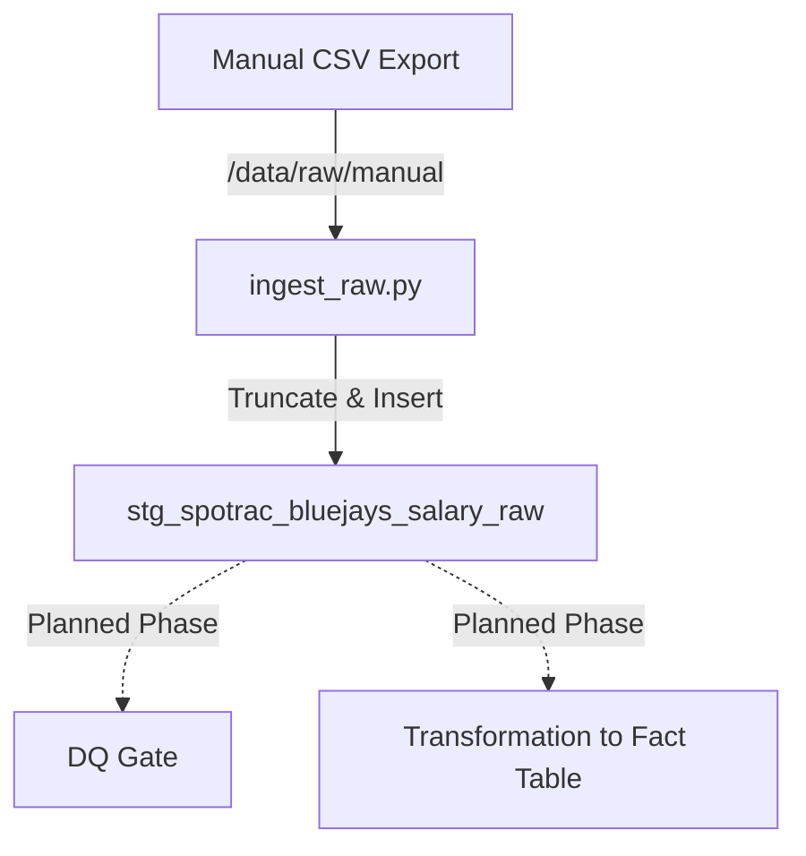

# ⚾ Blue Jays Moneyball: Data Quality–Driven ETL Platform


## 📌 Project Overview

This is a **production-oriented ETL and Data Quality platform** designed to ingest, normalize, and validate MLB player salary and performance data.

While many sports analytics projects focus solely on modeling, **Blue Jays Moneyball** prioritizes the engineering challenges that actually break production systems: **silent join failures, entity resolution issues, and data drift.**

**Core Philosophy:**
> "The hardest problems in analytics aren't the models—they are the pipelines that 'succeed' with corrupted outputs."

This system treats data engineering with **SDET principles**, enforcing strict quality gates to ensure that no data downstream is used for forecasting unless it is proven correct.

## 🔄 Recent Evolution (v2 Simplification)

We have executed a major architectural pivot to remove over-engineering and focus on **reliability first**.

- **Consolidated Pipeline:** Moved from multiple fragmented scripts to a single, clear DAG (`bluejays_simple_dag.py`).
- **Raw Ingestion First:** Implemented a pure "Extract & Load" pattern (`src/load/ingest_raw.py`) that loads CSV data into a text-based staging table without brittle transformations.
- **Schema Separation:** Decoupled schema definitions (`src/db/models.py`) from loading logic.
- **Cleanup:** Removed legacy scraping (Playwright) and complex mapping logic to establish a stable baseline.

---

## 🔁 Design Pivot: From Scraping to Manual Raw Ingestion

### Why We Stopped Scraping
Initial efforts to scrape Spotrac using Playwright revealed that the target site's obfuscated DOM and frequent structure changes made the pipeline brittle. In a production data quality context, **reliability is non-negotiable**.

### The New Approach: Raw Staging Layer
We now employ a **Manual CSV → Raw Staging** pattern.
1.  **Source:** Manually exported CSVs from Spotrac (treated as the immutable source of truth).
2.  **Ingestion:** A specialized loader (`ingest_raw.py`) reads the CSV and loads it into a PostgreSQL staging table (`stg_spotrac_bluejays_salary_raw`).
3.  **Data Type:** All columns are loaded as `TEXT`. This prevents "silent failures" caused by type mismatch (e.g., currency symbols, empty strings) during the load phase.

This approach ensures that **100% of the source data lands in the warehouse** every time. Validation and cleaning happen *inside* the warehouse, where we have full SQL power and auditability.

---

## 🏗 Architecture & Data Flow



### 🧱 Canonical Data Model (Staging)

* **`stg_spotrac_bluejays_salary_raw`**: The landing zone for salary data.
* **Strategy:** `TRUNCATE` -> `INSERT` (Full Refresh).
* **Schema:** Loose schema (all `TEXT`) to maximize ingestion success rate.
* **Metadata:** Includes `raw_loaded_at` timestamp for auditability.


---

## 📂 Project Structure

The project has been refactored to a lean, efficient structure:

```text
bluejays-financial-mlops/
├── dags/
│   └── bluejays_simple_dag.py     # Single source of truth DAG
├── src/
│   ├── db/
│   │   └── models.py              # Pure SQLAlchemy Schema definitions
│   └── load/
│       └── ingest_raw.py          # Specialized CSV Loader
├── data/
│   └── raw/manual/                # Immutable CSV landing zone
├── docker-compose.yaml            # Infrastructure (Airflow + Postgres)
├── requirements.txt
└── README.md

```

---

## ⚙️ How to Run

### 1. Build the Infrastructure

```bash
docker-compose build

```

### 2. Start Services

Launch Airflow (Scheduler, Webserver) and the PostgreSQL database.

```bash
docker-compose up -d

```

* **Airflow UI:** `http://localhost:8080`
* **Credentials:** `airflow` / `airflow`

### 3. Trigger the Pipeline

1. Navigate to the Airflow UI.
2. Trigger the **`bluejays_v2_simple_pipeline`** DAG.
3. This will execute the `ingest_raw_csv` task, which:
* Reads the CSV from `data/raw/manual/`.
* Truncates the staging table.
* Loads the new data.


### 4. Verify Data (SQL)

You can verify the load by connecting to the Postgres database:

```sql
SELECT * FROM stg_spotrac_bluejays_salary_raw LIMIT 10;

```

---

## 🗺 Roadmap

| Phase | Focus | Status |
| --- | --- | --- |
| **Phase 1** | **Raw Ingestion Pipeline** (CSV -> Staging) | ✅ **Complete** |
| **Phase 2** | **Fail-Fast DQ Gate** (Null Checks, Schema Validation) | 🚧 In Progress |
| **Phase 3** | **Transformation Layer** (Text -> Numeric, Entity Resolution) | ⏳ Planned |
| **Phase 4** | **CBT Simulation Engine** | ⏳ Planned |

---

## 👨‍💻 About the Author

**Chris (Suk Min) Yoon**
*Senior SDET / Data QA Engineer (10+ Years Experience)*

Specializing in **ETL Validation**, **Data Integrity**, and **Automation-First Quality Systems**.

> **Note:** This repository intentionally prioritizes data correctness over analytics output. The foundational belief is that you cannot model what you cannot reliably ingest.
