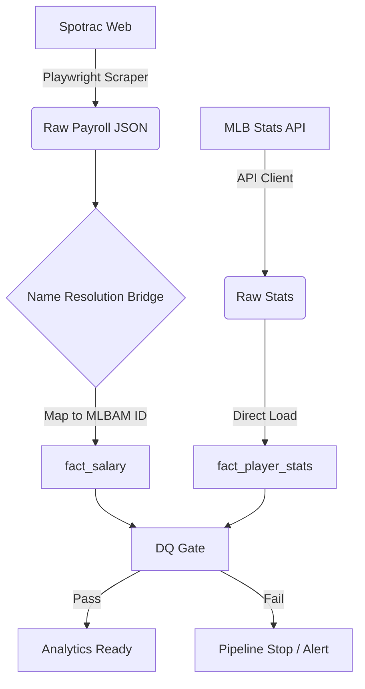

# ⚾ Blue Jays Moneyball: Data Quality–Driven ETL Platform


## 📌 Project Overview

This is a **production-oriented ETL and Data Quality platform** designed to ingest, normalize, and validate MLB player salary and performance data.

While many sports analytics projects focus solely on modeling, **Blue Jays Moneyball** prioritizes the engineering challenges that actually break production systems: **silent join failures, entity resolution issues, and data drift.**

**Core Philosophy:**
> "The hardest problems in analytics aren't the models—they are the pipelines that 'succeed' with corrupted outputs."

This system treats data engineering with **SDET principles**, enforcing strict quality gates to ensure that no data downstream is used for forecasting unless it is proven correct.

---

## 🎯 Key Objectives

1.  **Canonical Entity Resolution:** Deterministically map name-based external data (Spotrac) to canonical MLBAM IDs (`player_id`) using a dedicated bridge table.
2.  **Deterministic Joins:** Ensure 100% reliable joins between disparate salary data and player performance stats.
3.  **Fail-Fast Data Quality:** Detect and block bad data *immediately* via explicit DQ checks in the orchestration layer.
4.  **Automated Infrastructure:** End-to-end execution in **Airflow + Docker + PostgreSQL** without manual intervention.

---

## 🏗 Architecture & Data Flow

This project implements a **Extract → Map → Load → Verify** pattern to ensure integrity.



### 🧱 Canonical Data Model (Star Schema)

* **`dim_players`**: The source of truth for player identity (Key: `player_id`).
* **`fact_salary`**: Financial snapshots resolved to the canonical ID.
* **`fact_player_stats`**: Performance metrics from the MLB API.
* **`bridge_spotrac_player_map`**: A durable mapping table handling name variations (e.g., "Mike Trout" vs "Michael Trout").

---

## 🛡️ Data Quality Gate (Core Feature)

Before any data is promoted to the analytics layer, the **DQ Gate** enforces four strict pillars of integrity. If *any* check fails, the pipeline halts to prevent contamination.

| Check | Description |
| --- | --- |
| **1. Join Coverage** | Verifies 100% of `fact_salary` rows map to valid entries in `dim_players` and `fact_player_stats`. |
| **2. Null Integrity** | Enforces that critical keys (like `player_id`) are never `NULL` in fact tables. |
| **3. Duplicate Detection** | Scans for primary key violations (e.g., duplicate `season` + `player_id` entries per snapshot). |
| **4. Snapshot Drift** | Monitors row counts against previous snapshots to detect sudden data loss (Drift > Threshold). |

---

## 🛠 Tech Stack

* **Language:** Python 3.12+
* **Orchestration:** Apache Airflow 2.10+
* **Database:** PostgreSQL (Star Schema)
* **Scraping:** Playwright (Chromium, Dockerized)
* **ORM:** SQLAlchemy
* **Infrastructure:** Docker, Docker Compose
* **Quality Assurance:** Flake8, Pytest, Custom DQ Framework

---

## 📂 Project Structure

```text
bluejays-financial-mlops/
├── dags/
│   ├── payroll_etl_dag.py       # Main Airflow DAG defining the workflow
│   └── bluejays_pipeline.py     # Pipeline orchestration logic
├── src/
│   ├── db/
│   │   ├── session.py           # Database engine & session management
│   │   └── models.py            # SQLAlchemy schemas (Dim/Fact/Bridge)
│   ├── extract/
│   │   ├── spotrac.py           # Playwright-based Spotrac scraper
│   │   └── mlb_stats_api.py     # MLB Stats API ingestion module
│   ├── load/
│   │   ├── map_spotrac.py       # Name resolution logic (The Bridge)
│   │   ├── load_salary.py       # Loader for fact_salary
│   │   └── load_stats.py        # Loader for fact_player_stats
│   └── dq/
│       └── checks.py            # The Data Quality Gate logic
├── docker-compose.yaml          # Infrastructure definition
├── Dockerfile.airflow           # Custom Airflow image with Playwright
├── requirements.txt             # Python dependencies
└── tests/                       # Unit and Integration tests

```

---

## ⚙️ How to Run

### 1. Build the Infrastructure

Build the custom Docker image. We use `--no-cache` to ensure the latest browser binaries are installed.

```bash
docker-compose build --no-cache

```

### 2. Start Services

Launch Airflow (Scheduler, Webserver) and the PostgreSQL database.

```bash
docker-compose up -d

```

* **Airflow UI:** `http://localhost:8080`
* **Credentials:** `airflow` / `airflow`

### 3. Trigger the Pipeline

1. Navigate to the Airflow UI.
2. Enable and trigger the **`bluejays_payroll_pipeline`** DAG.
3. Watch the graph execute:
* **Extract:** Scrape Spotrac & call MLB API.
* **Transform/Load:** Resolve identities and populate facts.
* **Verify:** Execute the DQ Gate (Green = Pass, Red = Block).


---

## 🗺 Roadmap

| Phase | Focus | Status |
| --- | --- | --- |
| **Phase 1** | **Canonical ETL + DQ Gate** (Entity Resolution, Deterministic Joins) | ✅ **Complete** |
| **Phase 2** | **"What-If" Simulation Engine** (Roster Trades, Signings) | ⏳ Planned |
| **Phase 3** | **MLOps & Forecasting** (Salary Arbitration Predictions) | ⏳ Planned |

---

## 👨‍💻 About the Author

**Chris (Suk Min) Yoon**
*Senior SDET / Data QA Engineer (10+ Years Experience)*

Specializing in **ETL Validation**, **Data Integrity**, and **Automation-First Quality Systems**.

> **Note:** This repository intentionally prioritizes data correctness over analytics output. Every future model or forecast depends on this foundation—and this project proves that foundation is solid.

```

```