# ⚾ Blue Jays Moneyball: Data Quality–Driven ETL Platform


## 📌 Project Overview

This is a **Production-Grade Data Engineering Platform** designed to ingest, validate, and transform MLB player financial data.

Unlike typical analytics projects that focus solely on "getting data," this project prioritizes **Data Integrity, Auditability, and System Reliability**. It demonstrates a **Senior SDET / Data QA** approach to building pipelines: **"If the data quality cannot be guaranteed, the pipeline must fail."**

---

## 🔄 The Architectural Pivot: Reliability > Complexity

### 🚫 Phase 1: The Trap of Over-Engineering
Initially, this project utilized a complex **Playwright & Selenium** web scraper to fetch data from Spotrac.
* **The Issue:** DOM structure changes caused frequent silent failures. The cost of maintenance outweighed the value of automation.
* **The Decision:** I deprecated the scraper in favor of **Manual Ingestion with Strict Validation**.

### ✅ Phase 2: The v2 Robust Architecture
I refactored the system into a **"Fail-Fast" ELT Pipeline**:
1.  **Ingestion:** Robust loading of raw CSVs into a `TEXT`-based Staging Layer (No type errors on load).
2.  **Guardrails:** A SQL-based **DQ Gate** that blocks downstream processing if data violates core business rules (Nulls, Duplicates, Invalid Formats).
3.  **Transformation:** A cleaned `Fact` table is created only *after* quality checks pass.
4.  **Regression Testing:** A dedicated CI/CD DAG that tests the pipeline itself against known "Bad Data" to ensure the safety mechanisms are working.

---

## 🏗 System Architecture

### 1️⃣ The Production Pipeline (`bluejays_v2_simple_pipeline`)

```mermaid
graph TD
    A[Source: Spotrac CSV] -->|ingest_raw.py| B[Staging: Raw Text Table]
    B --> C{DQ Gate}
    C -->|❌ Fail| D[BLOCK PIPELINE]
    C -->|✅ Pass| E[Transformation Layer]
    E -->|Clean & Type Cast| F[(Fact Table: fact_salary)]

```



### 2️⃣ The Regression Suite (`bluejays_regression_suite`)

*Runs on deployment to verify that DQ logic catches errors.*

```mermaid
graph TD
    subgraph Positive Test
    A[Load Clean Data] --> B{Verify DQ Passes}
    B -->|Success| C[✅ Test Passed]
    end
    
    subgraph Negative Test
    D[Load Bad Data] --> E{Verify DQ Fails}
    E -->|Caught Error| F[✅ Test Passed]
    end

```



---

## 🛡️ Key Features (The SDET Approach)

### 1. Robust Raw Ingestion

We load all data as `TEXT` first.

* **Why?** Loading `$10,000` directly into an `INTEGER` column causes ingestion failures.
* **Solution:** Load as text -> Audit -> Clean -> Cast. This ensures we never lose source data.

### 2. The Data Quality Gate (Fail-Fast)

Before any transformation, we run SQL checks located in `src/dq/sql/`.

* **Null Integrity:** Ensures key fields (Player Name, Season) are present.
* **Uniqueness:** Prevents duplicate salary entries.
* **Type Validation:** Uses Regex (`!~ '^\$?[0-9,]+'`) to detect garbage strings like "Unknown" or "TBD" in numeric fields.

### 3. The Regression Suite (CI/CD)

How do we know our tests work? **We test the tests.**

* The `bluejays_regression_suite` DAG loads a purely malicious dataset (`spotrac_bad_data.csv`).
* It asserts that the pipeline **fails**.
* If the pipeline accidentally succeeds on bad data, the Regression Suite fails, alerting the engineer that a guardrail is broken.

---

## 📂 Project Structure

```text
bluejays-financial-mlops/
├── dags/
│   ├── bluejays_simple_dag.py        # 🚀 Prod: Ingest -> DQ -> Transform
│   └── bluejays_regression_suite.py  # 🧪 QA: Meta-testing the pipeline
├── src/
│   ├── db/
│   │   └── models.py                 # SQLAlchemy Schemas (Staging & Fact)
│   ├── dq/
│   │   ├── checks.py                 # The DQ Gate Logic
│   │   └── sql/                      # SQL Validation Rules
│   │       ├── check_nulls.sql
│   │       ├── check_duplicates.sql
│   │       └── check_invalid_types.sql
│   └── load/
│       ├── ingest_raw.py             # Universal CSV Loader (Prod/Test modes)
│       └── transform_fact_salary.py  # ELT Logic (Text -> Number)
├── data/
│   └── raw/manual/
│       ├── spotrac_bluejays_2025.csv # ✅ Golden Data
│       └── spotrac_bad_data.csv      # ❌ Test Data (Chaos Engineering)
└── docker-compose.yaml

```

---

## ⚙️ How to Run

### 1. Build & Start

```bash
docker-compose build
docker-compose up -d

```

### 2. Run the Production Pipeline

1. Go to `http://localhost:8080` (User/Pass: `airflow`).
2. Trigger **`bluejays_v2_simple_pipeline`**.
3. Observe: Ingest (Success) → DQ (Success) → Transform (Success).

### 3. Run the Regression Test

1. Trigger **`bluejays_regression_suite`**.
2. Observe:
* **Task 1 (Clean Data):** Passes.
* **Task 2 (Bad Data):** The script detects the bad data, asserts failure, and returns **Success** (Green) because the system worked as designed.


---

## 👨‍💻 About the Author

**Chris (Suk Min) Yoon**
*Senior SDET / Data QA Engineer (10+ Years Experience)*

Specializing in **ETL Validation**, **Data Integrity**, and **Automation-First Quality Systems**.

> **Portfolio Note:** This project demonstrates the discipline to prioritize system stability. By implementing a Regression Suite for the data pipeline itself, I ensure that data quality rules are treated as first-class code citizens that must pass CI/CD.
